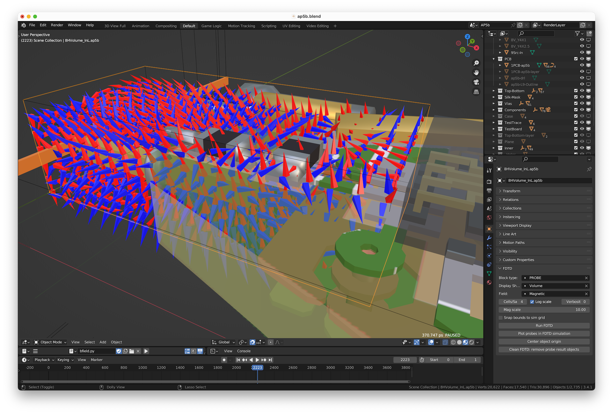

# BField
FDTD Electromagnetic Field Solver, with Blender front end

A fun exercise seeing if I can match the output of Cray's old LC field solver for 32-bit Linux, one of dozens of abandoned solvers (https://cecas.clemson.edu/cvel/modeling/EMAG/Old-codes.html). These have been superseded in part by MIT's open-source Meep (https://meep.readthedocs.io/en/latest/).

This also updates the interface to use Blender (https://www.blender.org) for model creation and field visualization while running. And matplotlib to duplicate its probe plots.

The math (see bfield_server_eqns.pdf) is mostly from the excellent lecture slides of Dr. Raymond Rumpf at CEM, University of Texas at El Paso.

The bfield_test project is currently configured to compare the output of bfield to that from LC for one problem setup, step-by-step. Small differences start in the source element output. I'm trying to understand just what's happening there.

## Getting Started

### Mac and Linux Installation

Download Blender 3.4.1 from https://www.blender.org/download 

The file 'bl' is a command to launch Blender from the command line so Python output can be seen. If /usr/local/bin doesn't exist, you'll need to create it first with:

	sudo install -d /usr/local/bin/

Then type:

	sudo install bl /usr/local/bin/

The simulator requires libpng. Download the latest from libpng.org (libpng-1.6.39), untar it, cd to its directory and type:

	./configure
	make
	sudo make install

**Mac**: Drag Blender.app to /Applications. Open bfield.xcodeproj (launches XCode), and type a Cmd-B to build it.

**Linux**: Type "make". This builds "bfield", the simulation server, and "testmath".

Launch Blender, do File>Open and open bfield_test.blend. Drag up the bottom of the main viewport to reveal the Python console, and note the version of Python it's running. For Blender 3.4.1, it's Python 3.10.8.

If that version of Python isn't installed on your machine, you will need to download and install it so you can download the correct versions of modules. A quick way to check is to type "python3", and then a TAB key for auto-completion to see what's available.

The following python packages are required:

- matplotlib and its dependencies
- PIL
- mpl_toolkits
 
To insure that these are all installed, type:

**Mac**:

	brew install python@3.10
	python3.10 -m pip install matplotlib --user
	(cd to your bfield directory)
	mkdir scripts
	ln -s /opt/homebrew/lib/python3.10/site-packages scripts/modules
	cp siunits.py scripts/modules/

**Linux**:

	sudo apt-get install python3.10
	sudo apt-get install python3-pip
	python3.10 -m pip install matplotlib --user
	(cd to your bfield directory)
	mkdir scripts
	ln -s ~/.local/lib/python3.10/site-packages scripts/modules
	cp siunits.py scripts/modules/
    
In Blender, set Edit>Preferences>File Paths>Data>Scripts to the path of this scripts directory. Then go up a level and into Add-ons, set the filter to "User", click Install, choose the bfield.py file in your bfield directory, and click Install Add-on. Close Preferences and quit and restart Blender.

At this point you should be able to go to Edit>Preferences>Add-ons, set the filter to "User", and click the Enable button for this "Add Mesh: FDTD Field Sim" add-on. Check your terminal window for errors. If working, an "FDTD" panel should be appear in the Object Properties panel.

You may also wish to disable the Ubuntu's use of Super-P. See
https://askubuntu.com/questions/68463/how-to-disable-global-super-p-shortcut

## Usage

### To start the simulator

**Mac**: Open bfield.xcodeproj (launches XCode), and type a Cmd-R to start it running.

**Linux**: Type "./bfield" to start it.

- In XCode, click "play" button (run).

**Mac**: Type "bl" to launch Blender.

**Linux**: type "blender" to launch Blender.

- Open file platesm.blend.

The following keys are available (in Linux, Cmd is the Super key):

- **Cmd-R**: Run FDTD.

- **P**: Pause/unpause simulation.

- **Cmd-P**: Plot (only while paused).

- **Cmd-K**: Remove probe-generated objects before a save.

The usual procedure is to select a Blender scene (each containing one test setup), then type Cmd-R to start it running, and at any time a 'P' to pause followed by a Cmd-P to plot all graphs at the current simulation time, with another 'P' to continue.

### To test the example

- Select (left-click) on the "9ArrowsE.psm" block. It's a wireframe cube, which may already be showing its 3D array of field arrows.
- Select Objects (orange cube icon) in the Properties pane.
- Reveal the FDTD section, and click the "Run FDTD" button there (or just type a Cmd-R). The "All Output" pane back in XCode should have printed the startup sequence and "Running..." In Blender, at the bottom of the 3D View pane it should now show running status: a frame count incrementing about once a second, and a current time in ps. The evolving field state will be shown by field arrows. You may change viewpoint, etc. while it's running. Let it run for maybe 100 frames and then stop it by hitting ESC. The XCode output should show "Stopping" and "disconnect".
- In Blender in the Timeline pane, hit the rewind button and then the play button. The 3D array of field arrows in the 3D Viewer should be showing the animated evolving EM field.

## Contributing

Please read [CONTRIBUTING.md](https://github.com/forbes3100/bfield.git/blob/master/CONTRIBUTING.md) for details on our code of conduct, and the process for submitting pull requests to us.

## Authors

* **Scott Forbes** - *Initial work* - [forbes3100](https://github.com/forbes3100)

See also the list of [contributors](https://github.com/forbes3100/bfield.git/graphs/contributors) who participated in this project.

## License

This project is licensed under the GNU General Public License.

